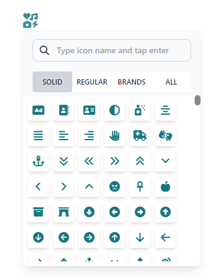

 <h1 style="text-transform:uppercase;font-weight:extrabold;color:blue">🔵 IconPicker Fontawesome Vue 3</h1>

 

## Installation

```
npm i iconpicker-fontawesome-vue3
```

or

```
yarn add iconpicker-fontawesome-vue3
```

<p id="getstart"></p>

# Get Start

<b style="text-transform:uppercase;color:blue">Import iconpicker-fontawesome-vue3 into your component</b>

```javascript
import IconpickerFontawesome from "iconpicker-fontawesome-vue3";

export default {
  name: "App",
  components: {
    IconpickerFontawesome,
  },
  data() {
    return {
      icon: null,
    };
  },
};
```

<b style="text-transform:uppercase;color:blue">Use the component</b>

<p><i>The model icon is a string with the name of the icon, pass a fontawesome icon as default, or leave it empty and the component will display a default icon on the button.</i></p>

```html
<div class="w-screen h-screen flex justify-center items-center flex-col">
  <IconpickerFontawesome v-model:icon="icon" />
</div>
```

<p id="options"></p>

## Options

<b style="text-transform:uppercase;color:blue">Properties accepted by ccomponent</b>

<table>
    <thead>
        <tr>
            <th>Prop</th>
            <th>Type</th>
            <th>Description</th>
            <th>Default</th>
        </tr>
    </thead>
    <tbody>
        <tr>
            <td>icon</td>
            <td>String [v-model]</td>
            <td>Icon to be selected</td>
            <td>fas fa-icons</td>
        </tr>
        <tr>
            <td>version</td>
            <td>Integer|String</td>
            <td>font awesome version (5 or 6)</td>
            <td>5</td>
        </tr>
        <tr>
            <td>Size</td>
            <td>Integer|String</td>
            <td>Button icon size</td>
            <td>25</td>
        </tr>
         <tr>
            <td>Color</td>
            <td>String</td>
            <td>Button icon color (hexadecimal or rgb)</td>
            <td>#097079</td>
        </tr>
        <tr>
            <td>height</td>
            <td>Integer</td>
            <td>Icon box height</td>
            <td>400</td>
        </tr>
         <tr>
            <td>width</td>
            <td>Integer</td>
            <td>Icon box width</td>
            <td>300</td>
        </tr>
         <tr>
            <td>searchPlaceholder</td>
            <td>String</td>
            <td>Text for placeholder in search inputt</td>
            <td>Type icon name and tap enter</td>
        </tr>
         <tr>
            <td>iconListSize</td>
            <td>Integer</td>
            <td>Icon size in icon list</td>
            <td>35</td>
        </tr>
         <tr>
            <td>iconListColor</td>
            <td>Integer</td>
            <td>Icon color in icon list</td>
            <td>#097079</td>
        </tr>
         <tr>
            <td>icons</td>
            <td>Object/Json</td>
            <td>If you have the pro version, click on the icons here. - <a href="#pro-icons">See how to do it</a></td>
            <td>[]</td>
        </tr>
    </tbody>
</table>

<p id="pro-icons" ></p>

## Pro version icons

<p><i>The icons in this pack available are from the free version of fontawesome, if you have the pro version, you can include the icons in the list.</i></p>
<p style="text-transform:uppercase;color:blue"><b>How to include pro version icons</b></p>
 
 <ol>
 <li> Locate the installed package. - <i>If the installation was done via npm, you will find it in node_modules</i> </li>

 <li>Import icons.json into your component.</li>
```javascript
import icons from "./fontawesome-pro-6.4.2/metadata/icons.json";
 ```

<li>Add the icons as reactive to your component.</li>
 
 <b> Options Api </p>

```javascript
import icons from "./fontawesome-pro-6.4.2/metadata/icons.json";

export default {
  data() {
    return {
      icons,
    };
  },
};
```

<b> Componsitions Api </p>

```javascript
import icons from "./fontawesome-pro-6.4.2/metadata/icons.json";
import { ref } from "vue";

export default {
  setup() {
    const iconsPro = ref(icons);
    return {
      iconsPro,
    };
  },
};
```

<b> Componsitions Api setup </p>

```javascript
import icons from "./fontawesome-pro-6.4.2/metadata/icons.json";
import { ref } from "vue";

const iconsPro = ref(icons);
```

<li>Pass the icons to the iconpicker-fontawesome-vue3 component</li>


```html
<IconpickerFontawesome v-model:icon="icon" :icons="iconsPro" />
```

</ol>
